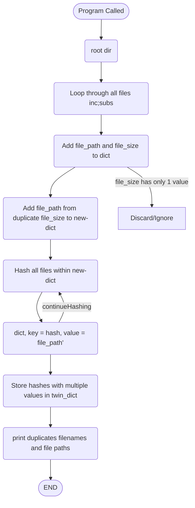

# Twin Duplicity Detector

This Python program is designed to go down a directory tree
searching for duplicate files.
It does this using OS.walk(), blake2b from hashlib and argparse for command line arguments.

### Functions
I have used 3 functions (At this stage.)

##### hash_file: 
This function will be called later to hash a specific file and store that hash and file path as a key/value pair dict.

##### file_hunter:
This function will primarily be looping through the files within the directory tree and calling the hash_file function on required files.

##### main:
This function will handle argument parsing, spinning up the file_hunter function, and it will handle printing the results at the end.

### FlowChart
